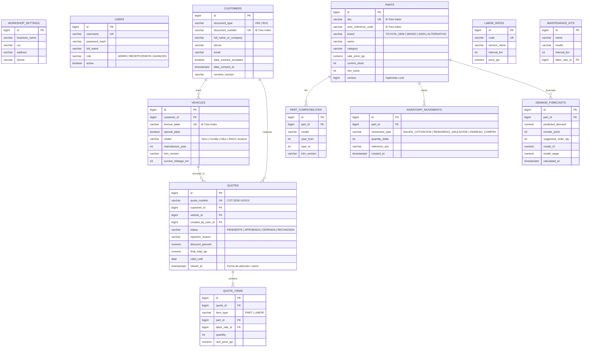

# Modelo de Datos Preliminar (`backend-crm`)

```mermaid
erDiagram
    WORKSHOP_SETTINGS {
        bigint id PK
        varchar business_name
        varchar ruc
        varchar address
        varchar phone
    }
    USERS {
        bigint id PK
        varchar username UK
        varchar password_hash
        varchar full_name
        varchar role "ADMIN | RECEPCIONISTA | ALMACEN"
        boolean active
    }
    CUSTOMERS {
        bigint id PK
        varchar document_type "DNI | RUC"
        varchar document_number UK "B-Tree Index"
        varchar full_name_or_company
        varchar phone
        varchar email
        boolean data_consent_accepted
        timestamptz data_consent_at
        varchar consent_version
    }
    VEHICLES {
        bigint id PK
        bigint customer_id FK
        varchar license_plate UK "B-Tree Index"
        boolean special_plate
        varchar model "Yaris | Corolla | Hilux | RAV4 | Avanza"
        int manufacture_year
        varchar trim_version
        int current_mileage_km
    }
    PARTS {
        bigint id PK
        varchar sku UK "B-Tree Index"
        varchar oem_reference_code "B-Tree Index"
        varchar brand "TOYOTA_OEM | DENSO | AISIN | ALTERNATIVO"
        varchar name
        varchar category
        numeric sale_price_igv
        int current_stock
        int min_stock
        bigint version "Optimistic Lock"
    }
    PART_COMPATIBILITIES {
        bigint id PK
        bigint part_id FK
        varchar model
        int year_from
        int year_to
        varchar trim_version
    }
    LABOR_RATES {
        bigint id PK
        varchar code UK
        varchar service_name
        int interval_km
        numeric price_igv
    }
    MAINTENANCE_KITS {
        bigint id PK
        varchar name
        varchar model
        int interval_km
        bigint labor_rate_id FK
    }
    QUOTES {
        bigint id PK
        varchar quote_number UK "COT-2026-XXXXX"
        bigint customer_id FK
        bigint vehicle_id FK
        bigint created_by_user_id FK
        varchar status "PENDIENTE | APROBADA | CERRADA | RECHAZADA"
        varchar rejection_reason
        numeric discount_percent
        numeric final_total_igv
        date valid_until
        timestamptz closed_at "Fecha de atención / cierre"
    }
    QUOTE_ITEMS {
        bigint id PK
        bigint quote_id FK
        varchar item_type "PART | LABOR"
        bigint part_id FK
        bigint labor_rate_id FK
        int quantity
        numeric unit_price_igv
    }
    INVENTORY_MOVEMENTS {
        bigint id PK
        bigint part_id FK
        varchar movement_type "SALIDA_COTIZACION | REINGRESO_ANULACION | INGRESO_COMPRA"
        int quantity_delta
        varchar reference_doc
        timestamptz created_at
    }
    DEMAND_FORECASTS {
        bigint id PK
        bigint part_id FK
        numeric predicted_demand
        int reorder_point
        int suggested_order_qty
        numeric model_r2
        numeric model_wape
        timestamptz calculated_at
    }
    CUSTOMERS ||--o{ VEHICLES : owns
    PARTS ||--o{ PART_COMPATIBILITIES : fits
    CUSTOMERS ||--o{ QUOTES : requests
    VEHICLES ||--o{ QUOTES : serviced_in
    QUOTES ||--|{ QUOTE_ITEMS : contains
    PARTS ||--o{ INVENTORY_MOVEMENTS : tracks
    PARTS ||--o{ DEMAND_FORECASTS : forecasts
```
